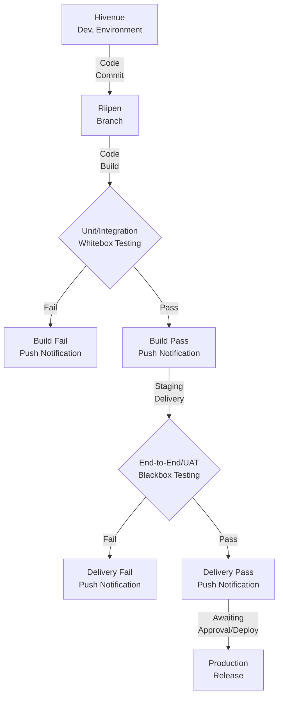

**Note:** This document will serve as an agreement between ***Hivenue*** and ***BTC6*** (Beyond The Cloud Team #06).

#
### Hivenue PoC: CTO

### BTC6:
- **Alejandro Castellanos** (He/His/Him)
- **Chima Annonye** (He/His/Him)
- **Haroon Khan** (He/His/Him)
- **Jayme Liao** (She/Her)
- **Mingxia Zeng** (She/Her)

#
#### [Hivenue Riipen Pages - https://beyondthecloud.riipen.com/teams/QVdXDavV](https://beyondthecloud.riipen.com/teams/QVdXDavV)

# Hivenue CI/CD

`Version: 1.0.0`

`Project Kick-off: Tue 2024 Oct 15 | 60Hrs. per 6 Weeks`

## Requirement:
Hivenue need to integrate ***Development Environment*** with a ***CI/CD Pipeline*** to *automate* production deployment.

### CI/CD Pipeline
1. **Build** (Packaging with Dependencies)
2. **Unit/Integration Testing** (Whitebox Testing)
3. **Staging** (Continues Delivery - Package/Image)
4. **End-to-End Testing** (Blackbox Testing/UAT)
5. **Push Notifications** (At each step)

### Hivenue CI/CD Pipeline

### Deliverables
1. **CI/CD IaC** (Infrastructure as Code)
2. **CI/CD IaC Documentation**
3. **Unit/Integration Testing Framework**
4. **Unit/Integration Testing Documentation**
5. **End-to-End Testing Framework**
6. **End-to-End Testing Documentation**

### CI/CD Infrastructure
